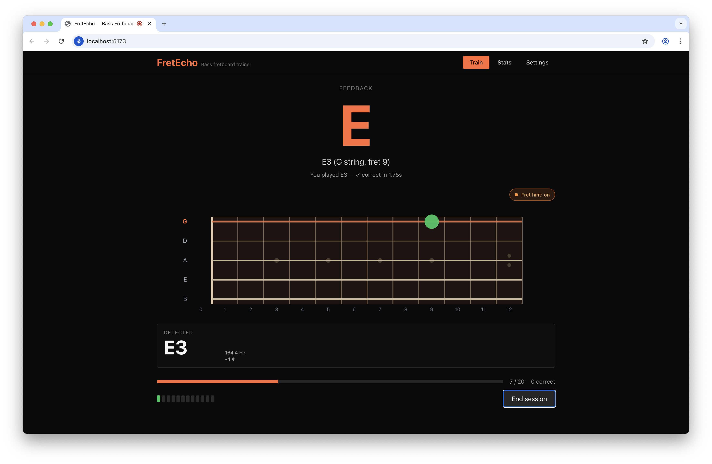

# FretEcho

**A call-and-response bass fretboard trainer that lives in your browser.**

FretEcho speaks a random note, you play it, and your microphone decides whether
you got it right. It keeps score of every position on the neck so you can see
exactly where your muscle memory is thin — and it weights future rounds toward
those weak spots.

No account, no install, no backend. Open the page, plug in a bass, and start
drilling.

---

## Features

- **Spoken call-and-response.** A synthesized voice prompts a note (e.g.
  *"G1 on the A string"*) and listens via your mic for your answer.
- **Real pitch detection** — uses the McLeod Pitch Method
  ([`pitchy`](https://github.com/ianprime0509/pitchy)) against the Web Audio
  API's analyser node. Works down to low B on a 5-string.
- **Note-name validation.** Any octave of the target note counts as correct,
  so octave-doubling quirks on low strings don't cheat you out of points.
- **Three prompt styles**
  - `C1 on the A string` — note, octave, and string
  - `C on the A string` — note class + string (octave-free)
  - `C1` — note only; play it anywhere on the neck
- **4-string and 5-string basses** with the usual `E A D G` and `B E A D G`
  tunings.
- **Configurable fret range, sharps/flats, notes per session.**
- **Weak-spot focus.** Toggles a weighted picker that biases future rounds
  toward positions you've missed or played slowly.
- **Live detected-note readout.** A constantly-updating display of whatever
  the mic is hearing — handy for identifying notes on the fretboard outside
  of a session, or for sanity-checking your low B.
- **Stats heatmap.** Per-position accuracy and speed, visualized on a
  fretboard.
- **Keeps listening on a miss.** Wrong answer? The engine stays on the same
  round, reveals the correct position, and waits for you to find it. You
  don't get to skip past a blind spot.
- **Single-beep errors.** If you sustain a wrong note, the error tone fires
  once and then shuts up. Play a *different* wrong note and it beeps again.
- **Mic-vs-speech deconfliction.** The pitch loop is paused while the voice
  prompt is playing, with a short guard window afterward so the tail of the
  synthesized word doesn't get judged as your performance.

## Why another fretboard trainer?

Most apps in this space are tap-the-answer quizzes. FretEcho closes the loop:
you actually play the note on the instrument, and the app actually listens.
That's what builds the ear → hand → fingerboard mapping you're after.

## Screenshot



*(Add a screenshot at `docs/screenshot.png` if you're checking this out from
a fresh clone.)*

## Getting started

### Prerequisites

- Node 18+
- A modern Chromium-based browser (Chrome / Edge / Arc / Brave) — Web Speech
  voice availability is best there
- A microphone near your bass amp or an audio interface routed as a mic input

### Run locally

```bash
npm install
npm run dev
```

Then open the URL Vite prints (usually `http://localhost:5173`) and grant mic
permission.

### Build for production

```bash
npm run build
npm run preview
```

The build is a fully static bundle under `dist/` — drop it on any static host
(GitHub Pages, Netlify, Cloudflare Pages, S3, your own nginx, etc.).

## How to use it

1. Go to **Settings** and pick your bass (4- or 5-string), fret range, prompt
   style, and whether to include sharps/flats.
2. Back on the **Train** tab, hit **Test mic** and pluck a few notes. You
   should see the detected pitch update in the "Detected" panel.
3. Press **Start session**. The voice will speak a note; play it on your
   bass. Correct answers advance to the next round. Wrong answers keep the
   round alive until you find the right note.
4. After the session finishes, check the **Stats** tab for your per-position
   heatmap.

### Tips

- **Palm-mute everything except the string you're playing.** Sympathetic
  resonance from open strings can confuse any pitch detector, including this
  one.
- **Turn on "Focus on weak spots"** once you've built up a few sessions of
  stats. It's a more efficient drill than pure random.
- **Use "Note only" mode** for ear-training drills where you pick the string
  yourself, and **"Note + string"** mode for position-specific muscle memory.
- **If pronunciation sounds off**, FretEcho automatically picks a Google or
  Microsoft English voice when available (they handle single letters like
  "A" correctly). On macOS, install an enhanced English voice via
  *System Settings → Accessibility → Spoken Content → System Voice →
  Manage Voices* if only Apple voices are available.

## Tech stack

| Layer             | Tool                                     |
| ----------------- | ---------------------------------------- |
| Build / dev       | [Vite](https://vitejs.dev/)              |
| UI                | React 18 + TypeScript (strict)           |
| Styling           | Tailwind CSS                             |
| State             | [zustand](https://github.com/pmndrs/zustand) + `localStorage` |
| Pitch detection   | [`pitchy`](https://github.com/ianprime0509/pitchy) (McLeod Pitch Method) on Web Audio API |
| Speech            | Web Speech API (`SpeechSynthesis`)       |
| Feedback tones    | Web Audio `OscillatorNode`               |

Everything runs client-side. There is no server, no account, no telemetry.
Your practice data lives in `localStorage` and nowhere else.

## Project layout

```
src/
  audio/          # mic input, pitch loop, TTS, feedback tones
  game/           # session engine, round picker
  music/          # MIDI / note-name math, tunings
  settings/       # zustand store for user settings
  stats/          # zustand store for per-position stats
  ui/             # React components (Training, Stats, Settings, Fretboard)
```

## Known limitations

- Pitch detection on very low strings (low B on a 5-string ≈ 31 Hz) is near
  the floor of what consumer mics and the McLeod method can resolve reliably.
  FretEcho sidesteps this by validating on note name only, so an octave
  mis-read still counts as correct — but expect occasional flutter on the
  detected-note readout.
- Web Speech voice availability varies wildly across browsers and OSes. If a
  voice isn't reading "A" as "ay", try a different browser.
- Tested primarily in Chrome on macOS. Firefox has partial Web Speech support;
  Safari's pitch detection latency is higher.

## License

MIT — see [LICENSE](./LICENSE).
